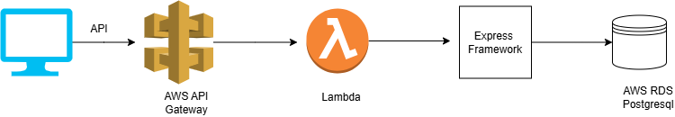
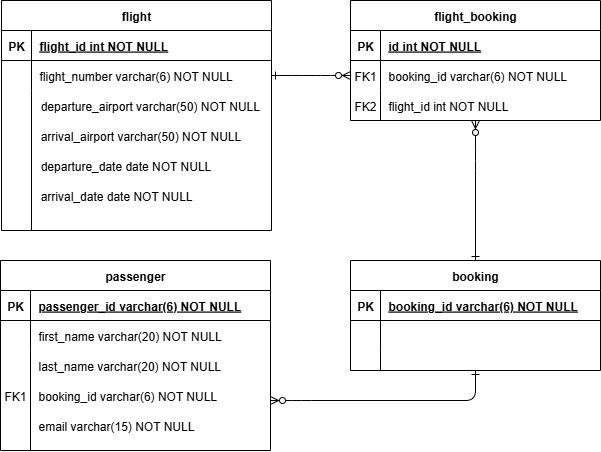

## Passenger API ##

### Solution Architecture ###

### DB Model and DB Design Decisions ###

• Four models defined: flight, passenger, booking, flight-booking 
• Added a join table flight-booking to include foreign key constraints and  preserve referential integrity 
## Technical Solution Decisions ##
| Tool/Technology | Reason |
|----------|----------|
| Express with serverless | • Can organize routes and logic clearly with Express  •  Express manages HTTP requests effectively within Lambda functions • Serverless Framework automates Lambda packaging and deployment |
| AWS Postgresql | • Relational database  • When data grows, postgresql supports materialized views for querying  |
| TypeORM |  • Support for Typescript   • Support for materialized views  | 

## Features Implemented  ##
 • Two endpoints implemented 
 • Support for strong typing with Typescript 
 • Input validation 
 • Logging 
 • Unit Testing  
