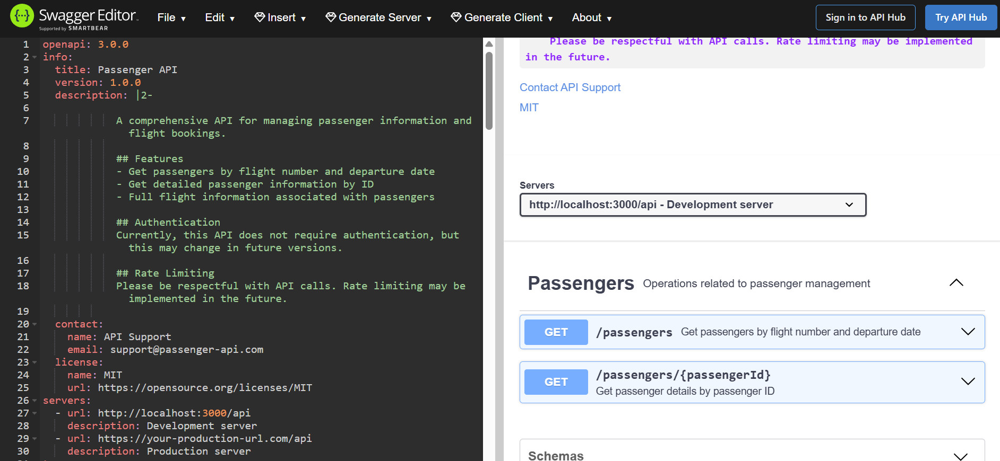

## Passenger API ##

### Installation Steps and Commands

#### To install
```npm install```
#### To run locally
``` npm run start:local```

#### To run tests
``` npm run test```

### Assumptions
• One flight will operate once per day <br>
• Booking id format: BK7M4Q (6 characters) <br>
• Flight number: AB123 - <2 characters><3 numbers> <br>
• Departure and arrival airports should be 3 characters eg: HEL <br>
• Passenger id should be SK1234: <2 characters><4 characters>  eg: HEL <br>

### Endpoints
#### To get list of passengers in a flight
``` http://localhost:3000/api/passengers?flightNumber=AB123&departureDate=2025-08-01 ```
#### To get passenger by id
```http://localhost:3000/api/passengers/SK1234```

### Solution Architecture ###


### DB Model and DB Design Decisions ###


• Four models defined: flight, passenger, booking, flight-booking<br>
• Added a join table flight-booking to include foreign key constraints and  preserve referential integrity<br>
## Technical Solution Decisions ##
| Tool/Technology | Reason |
|----------|----------|
| Express with serverless | • Can organize routes and logic clearly with Express<br> •  Express manages HTTP requests effectively within Lambda functions<br>• Serverless Framework automates Lambda packaging and deployment |
| AWS Postgresql | • Relational database<br> • When data grows, postgresql supports materialized views for querying<br> |
| TypeORM |  • Support for Typescript<br>  • Support for materialized views<br> | 

## Features Implemented  ##
 • Two endpoints implemented<br>
 • Support for strong typing with Typescript<br>
 • Input validation<br>
 • Logging<br>
 • Unit Testing <br>
 • API documentation support in Swagger <br>

## Swagger Documentation

Swagger json can be found here: http://localhost:3000/api/swagger.json
Can be viewed using Swagger Editor
